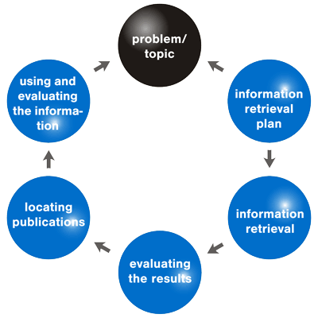

<h3>About</h3>

​	These two projects were part of the course Information Retrieval and Data Mining. The first project was for the Information Retrieval part and the second project was for the Machine Learning one. 

<h3>Project 1</h3> 

The purpose behind this project was to examine different methods for information retrieval. Information Retrieval isn't a simply task to do. There are many factors which can alter the results and give the user misleading information on the topic he searched for. To counter those problems we use a variety of techniques. Here we had a few queries, each one having a title (the basic query), a description of the query and a narrative. To improve the results of our basic queries we use the following methods:

- Query Expansion (most frequent terms from titles and desc)
- Synonyms on the above terms or our initial query
- Relevance Feedback (based on results, expand query with most frequent terms & synonyms)

<h3>Project 2</h3>

The purpose of the second project was to understand the basics of machine learning and then apply them to a problem. The problem was to determine whether the species engraulis encrasicolus was like to appear in a specific sea area. The dataset given was a simple csv with some features and observations of the species. Each team member had a different approach to the subject so we present two different Jupyter Notebooks along with their unique excel file. In the excel files we present our approaches and each step we took to optimize our algorithm. Of course the final version of our code (currently uploaded) is the one with the best results.

<h3>Built with</h3>

- Python
- Jupyter Notebook

<h3>Acknowledgments</h3>

- [Visualizing Data with Seaborn](https://deffro.github.io/data%20visualization/visualizations-with-seaborn/)
- [Indri Project Explanation and Tips](https://www.cs.cmu.edu/~lemur/3.1/IndriQueryLanguage.html)

